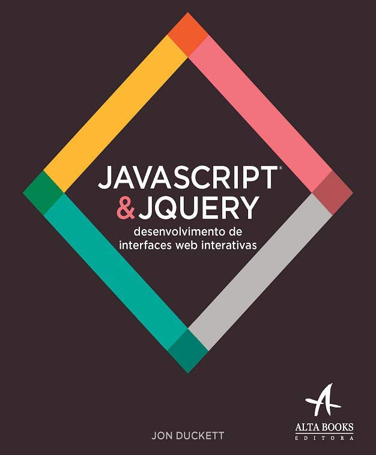

# JavaScript & jQuery

Código do livro: **JavaScript & jQuery**, interactive front-end web development. *- Jon Duckett*

   

## Observações

### Capítulo 8

Executar com:
> npx http-server [path]

*Em path, é necessário copiar o caminho da pasta*